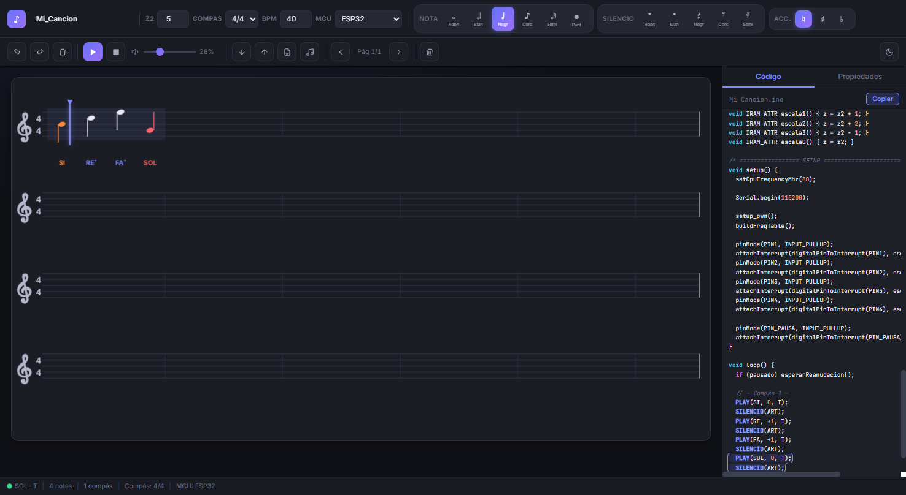
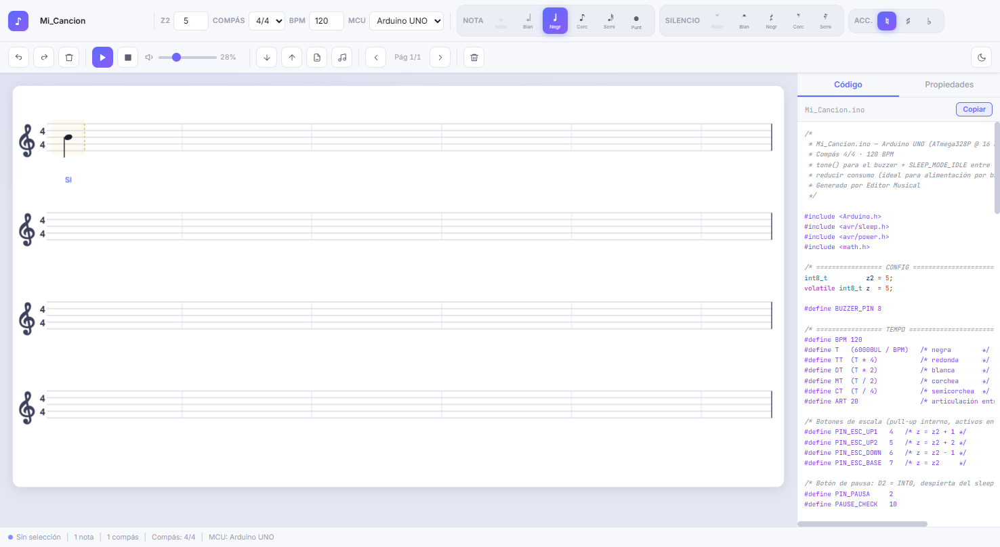

# 🎵 Editor Musical para Microcontroladores

**Compón en un pentagrama interactivo y obtén firmware listo para compilar en ESP32, Arduino UNO o ATmega328P.**


Aplicación web 100 % estática — sin build, sin frameworks, sin npm. Escribes notas
con el mouse, las escuchas en el navegador y exportas un `.ino` / `.c` que suena
idéntico en el hardware.

### 🌐 [▶ Pruébalo en vivo](https://hdzdaniel7.github.io/Interfaz-Musical---Microcontroladores/) — y pulsa el botón ✨ para cargar el Himno de la Alegría



<details>
<summary>🌞 Ver tema claro</summary>



</details>

---

## ✨ Características

### Composición
- 🎼 **Pentagrama interactivo** — clic para insertar, arrastrar para cambiar el tono, con *nota fantasma* que previsualiza dónde caerá la figura
- 🎯 **Validación estricta de compás** (2/4 · 3/4 · 4/4 · 6/8): las figuras que no caben se deshabilitan y los compases incompletos se marcan en ámbar
- 🎹 **Rango amplio**: de SOL una octava abajo (SOL₋) a RE dos octavas arriba (RE⁺²), relativo a la octava base `z2`
- ♯♭ **Accidentales con resolución enarmónica real** — SI♯ se convierte en DO de la octava siguiente, DO♭ en SI de la anterior, etc.
- ↩️ Deshacer/rehacer (80 niveles), puntillo, silencios de todas las figuras

### Reproducción
- ▶️ **Web Audio API** con timbre de onda cuadrada (suena como el buzzer real) y rampas anti-click
- 🔵 **Playhead animado** que recorre la partitura y cambia de página solo
- 🔊 Preview sonoro al insertar, arrastrar o transponer una nota
- 🎚️ Control de volumen y tempo (40–300 BPM) en vivo

### Generación de código
- 🧩 **Una plantilla por microcontrolador** — el combobox se genera desde un registro; agregar un MCU nuevo es crear un archivo
- 🕐 **El BPM viaja al firmware**: `#define BPM` → todas las duraciones se derivan de él
- 🔋 **Modo bajo consumo en las 3 plantillas** (light sleep / `SLEEP_MODE_IDLE`), pensado para alimentación por batería
- 🖍️ Resaltado de sintaxis C en vivo y **sincronía bidireccional**: clic en una nota resalta su línea `PLAY(...)`, clic en la línea selecciona la nota
- ➕ Campo de **código C adicional por MCU** que se inyecta en la plantilla y se guarda con el proyecto

### Proyecto
- 💾 Guardado automático en `localStorage` + exportar/importar proyecto `.json` (con validación y migración de versiones)
- 🎹 Exportación **MIDI** (formato 0, PPQ 480) para abrir tu melodía en cualquier DAW
- 🌗 Tema claro/oscuro persistente · interfaz HiDPI nítida · soporte táctil básico

---

## 🚀 Inicio rápido

La app usa módulos ES nativos, así que necesita servirse por HTTP (no `file://`):

```bash
# Opción 1 — VS Code: extensión Live Server → "Go Live"

# Opción 2 — Python
python -m http.server 8000

# Opción 3 — Node
npx serve
```

Abre `http://localhost:8000`, haz clic en el pentagrama y mira cómo el código
aparece en el panel derecho. **Exportar** descarga el archivo listo para el
IDE de Arduino o `avr-gcc`.

---

## 🔌 Microcontroladores soportados

| Plantilla | Archivo | Motor de sonido | Bajo consumo |
|---|---|---|---|
| **ESP32** | `.ino` | PWM por LEDC | `esp_light_sleep` + CPU a 80 MHz |
| **Arduino UNO** | `.ino` | `tone()` (Timer2) | `SLEEP_MODE_IDLE` entre ticks + periféricos apagados |
| **ATmega328P** | `.c` | PWM Timer1 bare-metal (avr-gcc, sin framework) | `SLEEP_MODE_IDLE` + registro PRR |

Las tres comparten la misma API musical, así que la partitura suena igual en cualquiera:

```c
PLAY(SOL, 0, T);          // nota SOL, octava base, una negra
PLAY(FAs, +1, MT);        // FA# una octava arriba, una corchea
PLAY(RE, +2, (T * 3/2));  // RE dos octavas arriba, negra con puntillo
SILENCIO(DT);             // silencio de blanca
```

Cada firmware incluye además: botón de **pausa/reanudación** por interrupción
(retoma la nota donde quedó) y botones de **cambio de escala** en vivo (z2 −1 … +2).

### Agregar un microcontrolador nuevo

1. Crea `js/codegen/templates/mi-mcu.js` exportando `{ id, label, extension, generate(ctx) }`
2. Impórtalo en `js/codegen/registry.js` y agrégalo a `TEMPLATES`

Eso es todo: el combobox, el nombre de archivo y la exportación se actualizan solos.

---

## ⌨️ Atajos de teclado

| Tecla | Acción | | Tecla | Acción |
|---|---|---|---|---|
| `1`–`5` | Redonda … semicorchea | | `← →` | Navegar entre notas |
| `R` | Alternar nota/silencio | | `↑ ↓` | Transponer nota seleccionada |
| `.` | Puntillo | | `Supr` | Borrar nota |
| `Espacio` | Reproducir / detener | | `Ctrl+Z` / `Ctrl+Y` | Deshacer / rehacer |

---

## 🏗️ Arquitectura

```
index.html
css/style.css            ← sistema de tokens, temas claro/oscuro
js/
├── main.js              ← punto de entrada (tema, recuperación, init)
├── constants.js         ← datos musicales y constantes de dibujo
├── music.js             ← alturas, enarmonía, análisis de compases
├── state.js             ← estado global, historia, persistencia
├── renderer.js          ← canvas: pentagrama, playhead, nota fantasma
├── audio.js             ← Web Audio: reproducción y previews
├── midi.js              ← exportación MIDI sin dependencias
├── ui.js                ← eventos, atajos, toasts, panel de código
└── codegen/
    ├── registry.js      ← registro de plantillas (fuente del combobox)
    ├── common.js        ← PLAY/SILENCIO, macros de tempo, utilidades
    └── templates/
        ├── esp32.js
        ├── arduino-uno.js
        └── atmega328p.js
```

**Decisiones de diseño:**

- **Afinación**: `DO0 = 16.3516 Hz`; con `z2 = 4`, LA = 440.00 Hz exactos.
  El navegador, el archivo MIDI y el firmware comparten la misma fórmula,
  por lo que lo que escuchas es lo que suena en el hardware.
- **Enarmonía por semitonos**: los accidentales se resuelven aritméticamente
  (`resolvePitch`), no con tablas — imposible generar un nombre de nota que
  no exista en el `enum` del firmware.
- **Layout proporcional**: cada compás ocupa un ancho fijo y cada figura un
  ancho proporcional a su duración, como en una partitura impresa.

---

## 🗺️ Hoja de ruta

- [ ] Selección múltiple y copiar/pegar compases
- [ ] Metrónomo con acento en el primer tiempo
- [ ] Exportar WAV (`OfflineAudioContext`)
- [ ] PWA instalable / uso offline
- [ ] Más plantillas (RP2040, STM32)

---

## 📄 Proyecto académico

Desarrollado como interfaz musical para la materia de Microcontroladores.
Las contribuciones y sugerencias son bienvenidas vía issues o pull requests.
